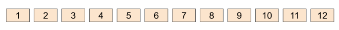
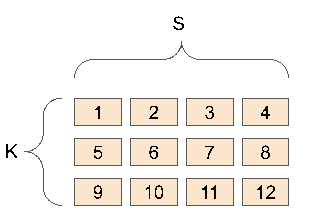
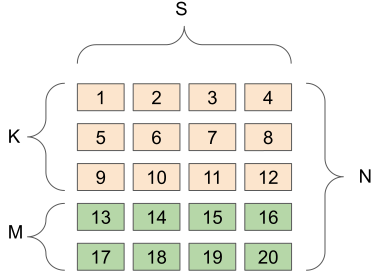
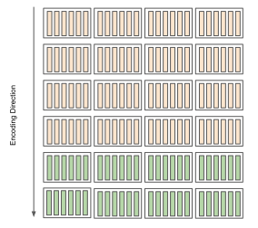

# Codex Erasure Coding

We present an interleaved erasure code that is able to encode arbitrary amounts of data despite the relatively small Reed-Solomon codeword size.

## Overview

Erasure coding has several complementing uses in the Codex system. It is superior to replication because it provides greater redundancy at lower storage overheads; it strengthens our remote storage auditing scheme by allowing to check only a percentage of the blocks rather than checking the entire dataset; and it helps with downloads as it allows retrieving $K$ arbitrary pieces from any nodes, thus avoiding the so called "stragglers problem".

We employ an Reed-Solomon code with configurable $K$ and $M$ parameters per dataset and an interleaving structure that allows us to overcome the limitation of a small Galois field (GF) size.

## Limitations of small GF fields

### Terminology

- A $codeword$ ($C$) is the maximum amount of data that can be encoded together, it cannot surpass the size of the GF field. For example $C <= GF(2^8) = C <= 256$.
- A $symbol$ ($s$) is an element of the of the GF field. A $codeword$ is composed of a number of symbols up to the size of the GF field. For example a field of $GF(2^8) = 256$ contains up to 256 symbols. The size of the symbol in bytes is also limited by the size of the GF field, a symbol in $GF(2^8)$ will have a max size of 8 bits or 1 byte.

The size of the codeword determines the maximum number of symbols that an error correcting code can encode and decode as a unit. For example, a Reed-Solomon code that uses a Galois field of $2^8$ can only encode and decode 256 symbols together. In other words, the size of the field imposes a natural limit on the size of the data that can be coded together.

Why not use a larger field? The limitations are mostly practical, either memory or CPU bound, or both. For example, most implementation rely on one or more arithmetic tables which have a linear storage overhead proportional to the size of the field. In other words, a fields of $2^{32}$ would require generating and storing several 4GB tables and it would still only allow coding 4GB of data at a time, clearly this isn't enough when the average high definition video file is several times larger than that and specially when the expectation is to allow handling very large, potentially terabyte size datasets, routinely employed in science and big-data.

## Interleaving

Interleaving is the process of combining or interweaving several symbols from disparate parts of the source data in ways that minimizes the likelihood that any sequence of these symbols is damaged together compromises the rest of the data.

In our case, the primary requirement is to ensure that we're preserving the dataset in its entirety and any $K$ elements are still enough to recover the original dataset. This is important to emphasize, we cannot simply encode a chunk of data individually, that would only protect that individual chunk, the code should protect the dataset in its entirety, even if it is terabytes size.

A secondary but important requirement is to allow appending data without having to re-encode the entire dataset.

### Codex Interleaving

Codex employs a type of interleaving where every $K$ symbols spaced at $S$ intervals, are encoded with additional $M$ parity symbols equally spaced at $S$ intervals. This results in a logical matrix where each row is $S$ symbols long and each column is $N=K+M$ symbols tall.

The algorithm looks like the following:

1) Given a dataset chunked in equally sized blocks and rounded up to the next multiple of $K$, where $K$ represents the number of symbols to be coded together and $M$ the resulting parity symbols.
2) Take $K$, $S$ spaced blocks and $K$ symbols $s$ from each of the selected blocks at offset 0 and encode into $M$ parity symbols each placed in new $S$ spaced blocks at the same offset. Repeat this steps at offset $1*sizeof(GF(p))$ and so on.
3) Repeat the above steps for the length of the entire dataset.

_Original Dataset Blocks_

_Matrix form K=3, S=4_

_Matrix form with parity blocks added K=3, M=2, N=5_

_Symbol coding direction_

The resulting structure is a matrix of height $N$ and width $S$, which allows loosing any $M$ "rows" of the matrix and still reconstruct the original dataset. Of course, loosing more than $M$ symbols in a given column would still render the entire dataset invalid, but the likelihood of that happening is mitigated by placing the individual original and parity blocks on independent locations.

Moreover, the resulting dataset is still systematic, which means that the original blocks are unchanged and can be used without prior decoding.
