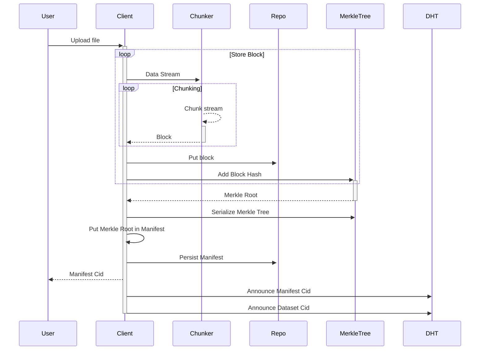
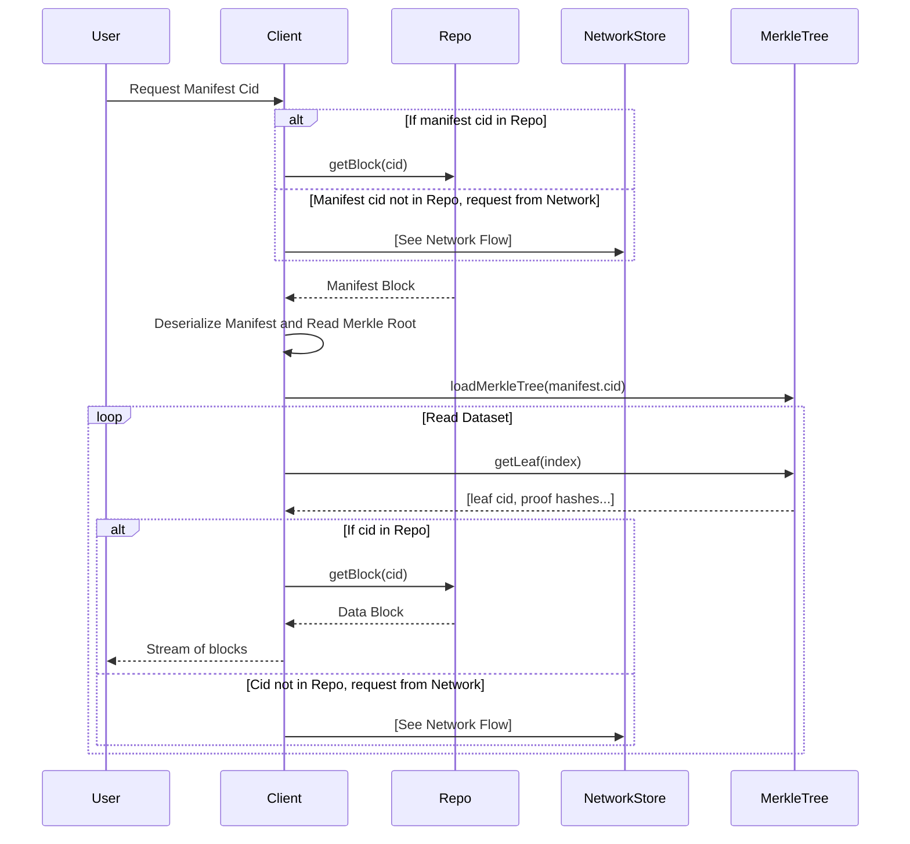
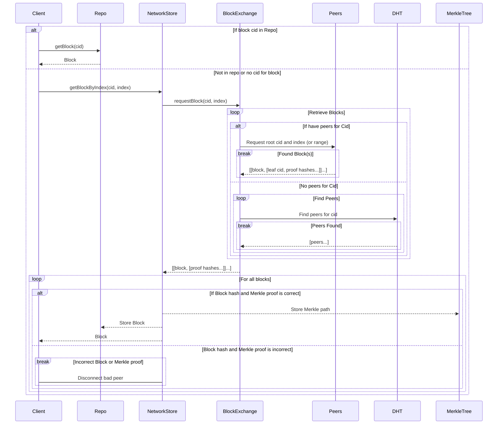

# Reducing Metadata Overhead

Metadata plays a crucial role in any distributed or peer-to-peer (p2p) storage network. However, it often incurs significant overhead for the system. Therefore, it is important to understand the required metadata and how it should be stored, located, and transmitted.

## Metadata and Manifests

Codex utilizes a metadata descriptor structure called the "manifest". A manifest is similar to a torrent file and stores various pieces of information necessary to describe a dataset.

```
  Manifest
    rootHash         # Cid of root (tree) hash of the contained data set
    originalBytes    # Exact size of the original (uploaded) file
    blockSize        # Size of each contained block
    blocks           # Array of dataset blocks Cids
    version          # Cid version
    hcodec           # Multihash codec
    codec            # Data set codec
```

Additional information that describes erasure coding parameters may also be included:

```
  Manifest
    ...
    ecK           # Number of blocks to encode
    ecM           # Number of resulting parity blocks
    originalCid   # The original Cid of the dataset being erasure coded
    originalLen   # The length of the original manifest
```

Manifests are treated as regular blocks of data, requiring no special handling by the Codex network or nodes. This means that announcing and storing manifests follows the same flow and uses the same subsystems as regular blocks. This convenience simplifies the execution flow significantly.

## Manifest limitations

Including block hashes in the manifest introduces significant limitations. Firstly, the size of the manifest grows linearly with the number of hashes and the size of the hashing function itself, resulting in increased overhead for storing and transmitting manifests.

Overall, large manifests impose additional burden on the network in terms of storage and transmission, resulting in unnecessary overhead. For example, when retrieving a sizable file, it becomes necessary to obtain all the hashes listed in the manifest before downloading the initial block. This process can require hundreds of megabytes of data.

One way to reduce the number of hashes is to increase the block size, which only partially addresses the problem. A better solution however, is to completely remove the blocks array from the manifest and instead rely on a Merkle proofs to verify the block.

## Slots and verification subsystem support

Besides the block hashes overhead, another reason for the change is the introduction of slots (verifiable dataset subsets) that nodes in a storage set/group store and verify. Slots require Merkle trees for verification, but otherwise are identical to the top-level dataset. Thus, storing and transmitting Merkle proofs is already a requirement for slot verification.

Replacing the blocks array with a proper Merkle tree would allow using the same mechanism proposed in this document, for both the top level dataset and for slot verification, storage and transmission. This greatly simplifies integration of the verification subsystem.

## Removing blocks array

As already mentioned, the new mechanism proposed here, removes the blocks array from the manifest file in favor of a separate Merkle tree. This Merkle tree is persisted in the local store, and transmitted along side the dataset blocks on retrieval. This allows verifying the transmitted blocks without knowing it's hashes a priory.

## Implementation overview

This mechanism requires an efficient Merkle tree implementation, which also allows persisting the leafs and intermediary hashes to disk; changes to the block exchange engine to support querying blocks by root hash and block index; and integration with the block store abstraction.

### Merkle Tree

The block hashes array is replaced by a Merkle tree. The Merkle tree should support persisting to disk, partial and non blocking reads/writes, loading and storing from (async) iterators. For reference, checkout out https://github.com/filecoin-project/merkletree.

### Block retrieval

#### Block Exchange Engine

The block exchange engine requires support for querying blocks by their index and respective dataset Merkle root. It also requires returning the Merkle proofs along side the chunk so that it can be readily verified. Scheduling blocks for retrieval should largely remain the same, but additional request and response messages are required.

#### Announcing over the DHT

Also, datasets are now announced by their Merkle root instead of each individual block as was the case in the previous implementation. Announcing individual blocks is still supported, for example manifests are announced exactly the same as before, by their cid. Announcing individual blocks is also supported (but not required) and can be usefull in the case of bandwidth incentives.

### Block Stores and Local Repo

All interaction with blocks/chunks sit behind the `BlockStore` abstraction, which currently only supports querying blocks by hash. It should be extended to allow querying by Merkle root and block index and/or range.

The local repo should be aware of the persisted Merkle tree. When a requests by index is made, the store first locates the persisted Merkle tree corresponding to the specified root and retrieves the requested leaf and corresponding Merkle proofs.

Once the hash of the request block is known, the repo/store can be queried for the block using the retrieved block hash.

Keeping support for hash based retrieval (content addressing) has two main advantages:

1. It preserves content addressing at the repo level, which enables content deduplication.
2. It allows keeping the number of required changes to a minimum, as once the block hash is know, the existing flow can be reused.

## Updated flow

### Upload



**Steps**:

1. User initiates a file upload
   1. Client chunks the stream and stores blocks in the Repo
   2. Block's hash is added to a MerkleTree instance
   3. This is repeated until all data has been read from the stream
2. Once all blocks have been stored, the Merkle root is generated and persisted
3. The manifest is persisted and serialized in the repo
4. The cid of the persisted manifest is returned to the user
5. Both the manifest Cid and the Dataset Merkle Root Cid are announced on the DHT
   1. This allows locating both the manifest and the dataset individually

### Retrieval

#### Local Flow



**Steps**:

1. User initiates a download with a manifest Cid
2. Client checks the local store for the manifest Cid
   1. If it exists, the manifest is deserialized and the Merkle root of the dataset is read
   2. Otherwise, the Cid is requested from the network store
3. Client checks the local repo for the Merkle tree root
   1. If it exists, the Merkle tree is deserialized and leaf hashes are read
   2. For each leaf hash which corresponds to the hash of the block
      1. The local repo is checked for the precense of the block
         1. If it exists, it is read from the local store and returned to the client
         2. Otherwise, the Cid is requested from the network store

#### Network Flow



**Steps**:

1. The client requests blocks from the network store, using the Merkle root and block index
   1. Network store requests the block from the BlockExchange engine
      1. BlockExchange checks connected peers for requested hash
         1. If they do, the block is requested using the root hash and index (or range) of the block
         2. Otherwise, it queries the DHT for the requested root hash
            1. Once new peers have been discovered and connected, go to step 1.1.1
2. Once blocks are received from the remote nodes
   1. The hashes are verified against the requested Merkle root and if they pass
      1. The block is persisted to the network
      2. The block hash (cid) and the Merkle proof are stored in the persisted Merkle tree
   2. Otherwise, the block is discarded and the node that sent the incorrect block disconnected
